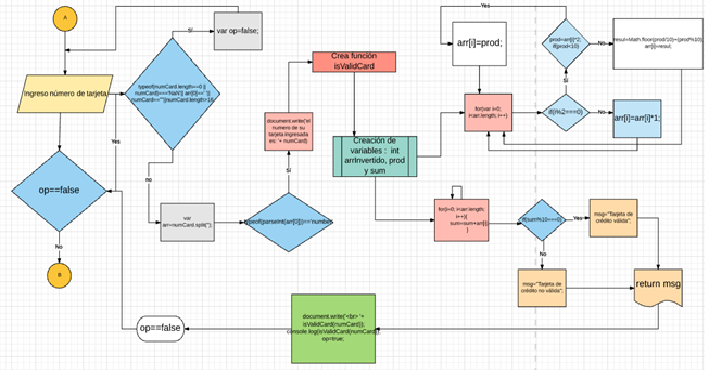
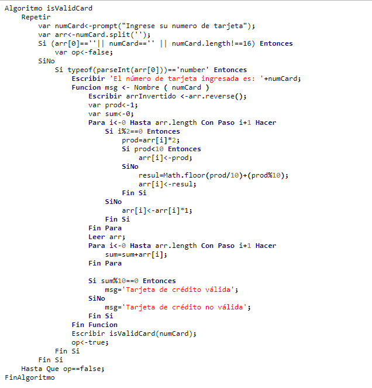

## TARJETA DE CREDITO VALIDA

Crea una web que pida, por medio de un prompt(), el número de una tarjeta de crédito y confirme su validez según el algoritmo de Luhn.
### ALGORITMO DE LUHN

La fórmula verifica un número contra su dígito de chequeo incluido, el cual el usualmente agregado a un número de cuenta parcial para generar el número de cuenta completo. Este número de cuenta debe pasar la siguiente prueba:

A partir del dígito de chequeo incluido, el cual está a la derecha de todo el número, ir de derecha a izquierda duplicando cada segundo dígito.
Sumar los dígitos del resultado: (ejemplo: 10 = 1 + 0 = 1, 14 = 1 + 4 = 5) juntos con los dígitos sin duplicar del número original.
Si el total de módulo 10 es igual a 0 (si el total termina en cero), entonces el número es válido de acuerdo con la fórmula Luhn, de lo contrario no es válido.

### **Consideraciones Específicas**

Tu código debe estar compuesto por 1 función: **isValidCard**

El usuario no debe poder ingresar un campo vacío

### DIAGRAMA DE FLUJO

### PSEUDOCODIGO

